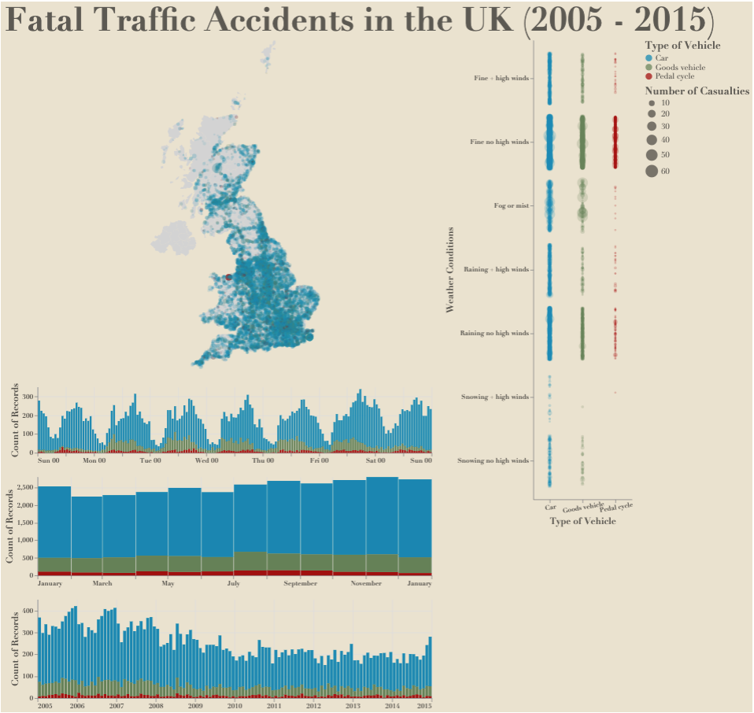

@import "../../lectures/css/datavis.less"

```elm {l=hidden}
import Tidy exposing (..)
import VegaLite exposing (..)
```

# Fatal Traffic Accidents in the UK (2005 - 2015)

```elm {l=hidden}
accidentData =
    dataFromUrl "https://cecilialiss.github.io/web/uk_accidents_fatal_clean.csv" []
```

#### Direction for the dashboard:

Drag to choose a time window in any of three bar charts. The corresponding records on the map and the other two bar charts will be shown. Double click on the bar chart to return to default setting. Move the cursor to the bar charts to show details.

```elm {v interactive}
map : Spec
map =
    let
        -- Colour encoding
        colorMap =
            [ ( "Car", "rgb(0, 134, 179)" ), ( "Goods vehicle", "rgb(100, 130, 85)" ), ( "Pedal cycle", "rgb(163, 0, 0)" ) ]

        -- Background map
        mapData =
            dataFromUrl "https://gicentre.github.io/data/uk/ukConstituencies.json" [ topojsonFeature "constituencies" ]

        specBackground =
            asSpec [ mapData, geoshape [ maFill "lightgrey", maStroke "" ] ]

        -- Data points on map
        trans =
            transform
                << filter (fiSelection "brush")

        encAccident =
            encoding
                << position Longitude [ pName "Longitude", pQuant ]
                << position Latitude [ pName "Latitude", pQuant ]
                << size
                    [ mName "Number_of_Casualties"
                    , mQuant
                    , mScale [ scDomain (doNums [ 1, 60 ]), scType scPow, scExponent 0.87 ]
                    , mLegend [ leTitle "Number of Casualties", leOrient loRight, leTitleFont "Didot", leTitleColor "rgb(92, 89, 82)", leTitleFontSize 16, leLabelFont "Didot", leLabelColor "rgb(92, 89, 82)", leLabelFontSize 12 ]
                    ]
                << opacity
                    [ mCondition (prParamEmpty "brush")
                        [ mNum 0.7 ]
                        [ mNum 0.1 ]
                    ]
                << color
                    [ mName "Vehicle_Type"
                    , mScale (categoricalDomainMap colorMap)
                    , mLegend [ leTitle "Type of Vehicle", leOrient loRight, leTitleFont "Didot", leTitleColor "rgb(92, 89, 82)", leTitleFontSize 16, leLabelFont "Didot", leLabelColor "rgb(92, 89, 82)", leLabelFontSize 12 ]
                    ]

        specCircle =
            asSpec [ encAccident [], trans [], circle [] ]

        -- map layer
        mapLayer =
            asSpec [ height 500, width 600, layer [ specBackground, specCircle ] ]

        -- Timeline layer
        ps =
            params
                << param "brush" [ paSelect seInterval [ seEncodings [ chX ], seSelectionMark [ smFillOpacity 0.5 ] ] ]

        vehicleSelectionTrans =
            transform
                << filter (fiSelection "legendSel")

        -- week and time layers
        encWeek =
            encoding
                << position X
                    [ pName "DateTime"
                    , pTitle ""
                    , pTemporal
                    , pTimeUnit dayHours
                    , pAxis
                        [ axFormat "%a %H"
                        , axTitleFont "Didot"
                        , axTitleColor "rgb(92, 89, 82)"
                        , axTitleFontWeight fwBolder
                        , axLabelFont "Didot"
                        , axLabelColor "rgb(92, 89, 82)"
                        , axLabelFontWeight fwBolder
                        ]
                    , pTitle ""
                    ]
                << position Y
                    [ pAggregate
                        opCount
                    , pAxis
                        [ axTitleFont "Didot"
                        , axTitleColor "rgb(92, 89, 82)"
                        , axTitleFontSize 14
                        , axTitleFontWeight fwBolder
                        , axLabelFont "Didot"
                        , axLabelColor "rgb(92, 89, 82)"
                        , axLabelFontWeight fwBolder
                        ]
                    ]
                << color [ mName "Vehicle_Type", mScale (categoricalDomainMap colorMap) ]

        specWeekBase =
            asSpec [ height 100, width 600, encWeek [], bar [ maFillOpacity 0.5 ] ]

        specWeekSelection =
            asSpec [ ps [], trans [], encWeek [], bar [ maTooltip ttEncoding ] ]

        specWeek =
            asSpec [ layer [ specWeekBase, specWeekSelection ] ]

        -- month layers
        encMonth =
            encoding
                << position X
                    [ pName "DateTime"
                    , pTitle ""
                    , pTemporal
                    , pTimeUnit month
                    , pAxis
                        [ axFormat "%B"
                        , axTitleFont "Didot"
                        , axTitleColor "rgb(92, 89, 82)"
                        , axTitleFontWeight fwBolder
                        , axLabelFont "Didot"
                        , axLabelColor "rgb(92, 89, 82)"
                        , axLabelFontWeight fwBolder
                        ]
                    , pTitle ""
                    ]
                << position Y
                    [ pAggregate
                        opCount
                    , pAxis
                        [ axTitleFont "Didot"
                        , axTitleColor "rgb(92, 89, 82)"
                        , axTitleFontSize 14
                        , axTitleFontWeight fwBolder
                        , axLabelFont "Didot"
                        , axLabelColor "rgb(92, 89, 82)"
                        , axLabelFontWeight fwBolder
                        ]
                    ]
                << color [ mName "Vehicle_Type" ]

        specMonthBase =
            asSpec [ height 150, width 600, encMonth [], bar [ maFillOpacity 0.5 ] ]

        specMonthSelection =
            asSpec [ ps [], trans [], encMonth [], bar [ maTooltip ttEncoding ] ]

        specMonth =
            asSpec [ layer [ specMonthBase, specMonthSelection ] ]

        -- monthYear layer
        encYearMonth =
            encoding
                << position X
                    [ pName "DateTime"
                    , pTemporal
                    , pTimeUnit yearMonth
                    , pAxis
                        [ axFormat "%Y"
                        , axTitleFont "Didot"
                        , axTitleColor "rgb(92, 89, 82)"
                        , axTitleFontWeight fwBolder
                        , axLabelFont "Didot"
                        , axLabelColor "rgb(92, 89, 82)"
                        , axLabelFontWeight fwBolder
                        ]
                    , pTitle ""
                    ]
                << position Y
                    [ pAggregate
                        opCount
                    , pAxis
                        [ axTitleFont "Didot"
                        , axTitleColor "rgb(92, 89, 82)"
                        , axTitleFontSize 14
                        , axTitleFontWeight fwBolder
                        , axLabelFont "Didot"
                        , axLabelColor "rgb(92, 89, 82)"
                        , axLabelFontWeight fwBolder
                        ]
                    ]
                << color [ mName "Vehicle_Type", mScale (categoricalDomainMap colorMap) ]

        specYearMonthBase =
            asSpec [ height 150, width 600, encYearMonth [], bar [ maFillOpacity 0.5 ] ]

        specYearMonthSelection =
            asSpec [ ps [], trans [], encYearMonth [], bar [ maTooltip ttEncoding ] ]

        specYearMonth =
            asSpec [ layer [ specYearMonthBase, specYearMonthSelection ] ]

        -- layer for map and timeline
        specMapBar =
            asSpec [ vConcat [ mapLayer, specWeek, specMonth, specYearMonth ] ]

        -- scatter
        transJitter =
            transform
                << calculateAs "random()" "jitter"

        encScatter =
            encoding
                << position X
                    [ pName "Vehicle_Type"
                    , pNominal
                    , pTitle "Type of Vehicle"
                    , pAxis [ axLabelAlign haCenter, axLabelAngle -10, axTitleFont "Didot", axTitleFontSize 14, axTitleFontWeight fwBolder, axTitleColor "rgb(92, 89, 82)", axLabelFont "Didot", axLabelColor "rgb(92, 89, 82)", axLabelFontWeight fwBolder ]
                    ]
                << position Y
                    [ pName "Weather_Conditions"
                    , pNominal
                    , pAxis [ axLabelAngle 0, axTitleFont "Didot", axTitleFontSize 14, axTitleColor "rgb(92, 89, 82)", axTitleFontWeight fwBolder, axLabelFont "Didot", axLabelColor "rgb(92, 89, 82)", axLabelFontWeight fwBolder ]
                    , pTitle "Weather Conditions"
                    ]
                << position YOffset
                    [ pName "jitter" ]
                << size
                    [ mName "Number_of_Casualties"
                    , mQuant
                    , mScale [ scDomain (doNums [ 1, 60 ]), scType scPow, scExponent 0.87 ]
                    ]
                << color
                    [ mName "Vehicle_Type"
                    , mScale (categoricalDomainMap colorMap)
                    ]

        specScatter =
            asSpec [ height 700, width 150, accidentData, transJitter [], encScatter [], circle [ maOpacity 0.2 ] ]

        -- Configuration
        cfg =
            configure
                << configuration (coView [ vicoStroke Nothing ])
    in
    toVegaLite
        [ accidentData
        , cfg []
        , title "Fatal Traffic Accidents in the UK (2005 - 2015)"
            [ tiFontSize 50, tiFont "Didot", tiColor "rgb(92, 89, 82)" ]
        , background "rgb(235, 226, 206)"
        , hConcat [ specMapBar, specScatter ]
        ]
```



### Source of Data

UK Traffic Accidents
https://www.kaggle.com/code/ambaniverma/uk-traffic-accidents

As the original whole dataset is over 100 MB, only fatal traffic accidents are filtered out for this coursework.
